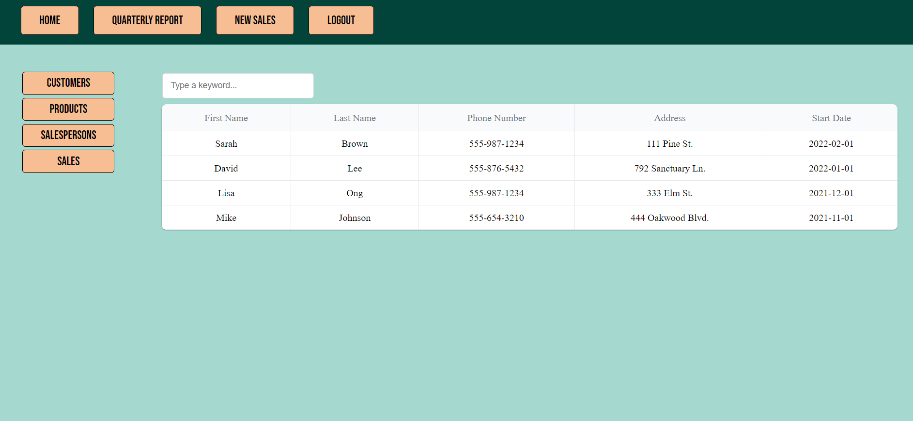

# BeSpokedBikes
## Description 
BeSpoked Bikes is looking to create a sales tracking application. BeSpoked is a high-end bicycle shop and each salesperson gets a commission for each bike they sell. They are introducing a new quarterly bonus based on sales as an incentive.

  ## Table of Contents
  - [Installation](#installation)
  - [Features](#features)
  - [Screenshots](#screenshots)
  - [Contributing](#contributing)
  - [Tests](#tests)
  - [Questions](#questions)

## Installation
  ```
  git clone https://github.com/odthientho/BeSpokedBikes.git
  ```
  To install packages:
  ```
  npm i
  ```
  To create database and seed database: (setup enviroments .env)
  ```
  source schema.sql
  npm run seed
  ```
  
## Features 
```
* Landing Page shows all servies
* Authentication System handles user accounts: Login, Logout, Signup.
* Online Booking System for both customers and managers.
* Customer Page shows customer appointments
* Manager Page shows all customers appointments in Calendar.
* SMS Messaging helps as appointment reminders to customers.
* UI Responsive and Interactive with different screens (Smart Phone/Tablet/ Desktop) compatibility.
```
  
## Screenshots 
* Homepage with services:


* Login & Sign-up page:


* Customer Appointment Bookings:


* Manager Appointments Management:


## Packages
``` 
  "bcrypt": "^5.0.0",
  "connect-session-sequelize": "^7.0.4",
  "dotenv": "^8.2.0",
  "express": "^4.18.2",
  "express-handlebars": "^5.2.0",
  "express-session": "^1.17.1",
  "mysql2": "^2.2.5",
  "sequelize": "^6.3.5",
```

## Contributing
Follow the repo link below and submit a pull request. 
Contributions to the development of this application are welcome. 
[Polised-Booking-App](https://github.com/lflyew/Polished) 

## Questions
If you have any questions about the repo, open an issue or contact us directly at odthientho@gmail.com. 

You can find more our projects at [odthientho](https://github.com/odthientho/), 